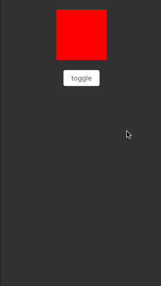
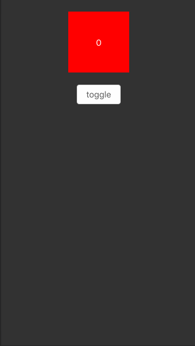
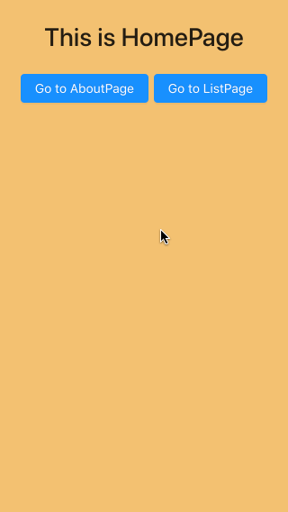
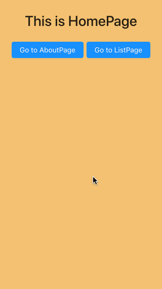

## 使用

```bash
git clone https://github.com/SmallStoneSK/react-router-animation-demo.git
cd react-router-animation-demo
npm install
npm start
```

## 注意事项

1. 在手机模式下预览效果更加。
2. 本项目一共有6个例子，每次运行某个例子时，请将其他例子的import语句注释掉，以避免可能存在的css覆盖。

## 预览

### App1

<div align="center">
  
</div>

### App2

<div align="center">
  
</div>

### App3

<div align="center">
  
</div>

### App4

<div align="center">
  
</div>

### App5

<div align="center">
  
</div>

### App6

<div align="center">
  
</div>